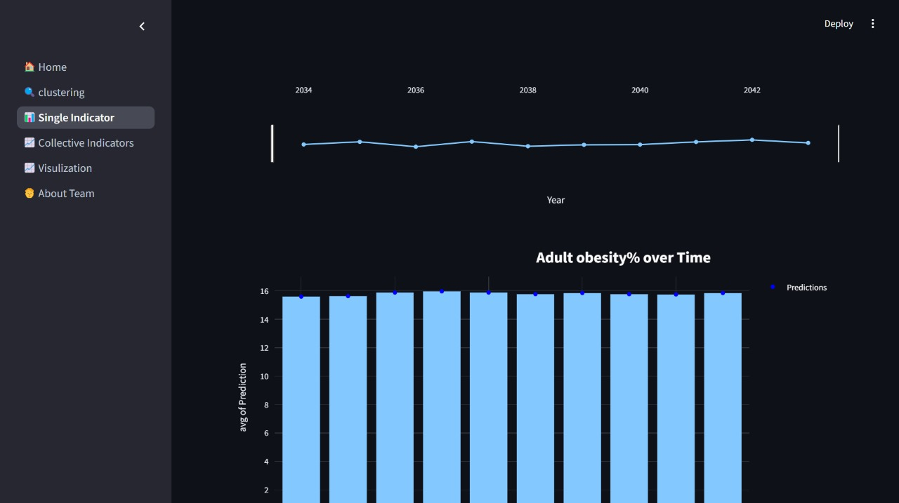
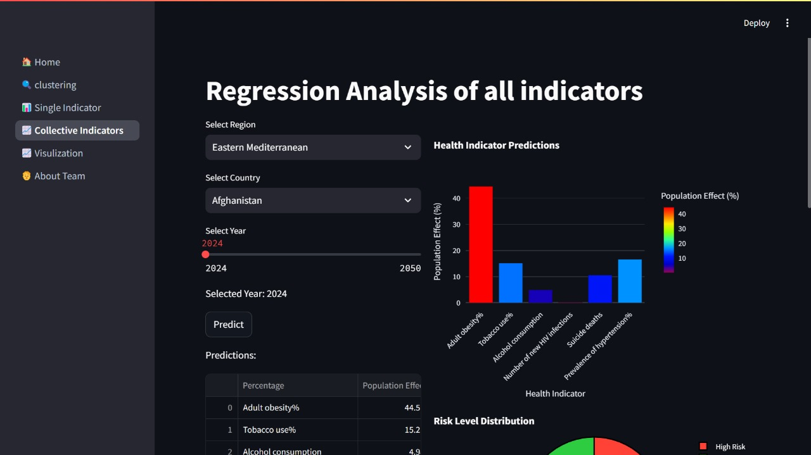
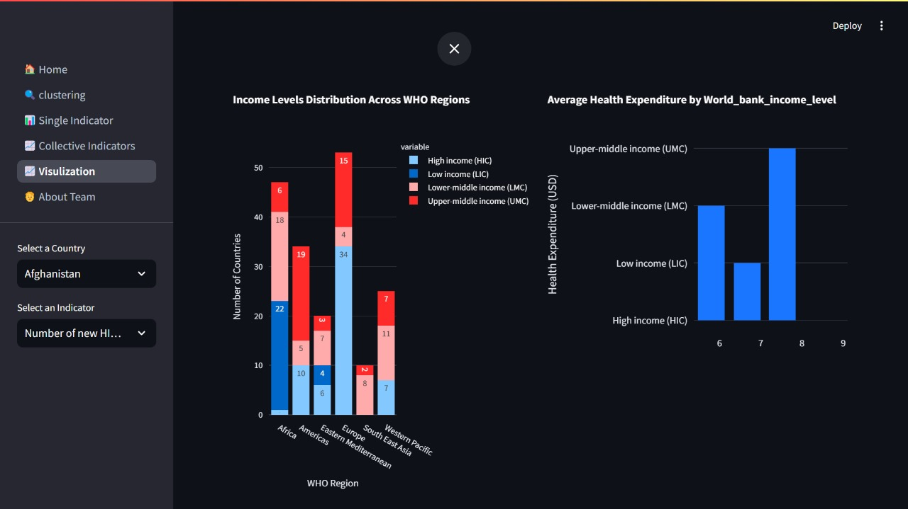

# Healthcare Resource Management System

This project leverages data from the World Health Organization (WHO) to build machine learning models that predict disease spread and optimize resource allocation for public health management. The data includes metrics like disease cases, recovery rates, vaccination rates, and hospital capacity, which are visualized using Power BI and processed with machine learning for predictive insights.


[Watch Project Demo Video](visualization/project%20demo.mp4)









## Table of Contents
- [Features](#features)
- [Prerequisites](#prerequisites)
- [Getting Started](#getting-started)
  - [Clone the Repository](#clone-the-repository)
  - [Set Up a Virtual Environment](#set-up-a-virtual-environment)
  - [Install Requirements](#install-requirements)
  
## Features
- **Data Ingestion**: Scrapes and processes healthcare data from WHO.
- **Visualization**: Power BI dashboards for healthcare trends (disease cases, recoveries, vaccination rates, hospital capacity).
- **Predictive Analytics**: Machine learning models that predict disease spread.
- **Resource Optimization**: Data-driven decision-making for public health resource allocation.
  
## Prerequisites
Before running the project, make sure you have the following installed:

- **Python 3.8+**: The core programming language used in this project.
- **Git**: For cloning and version control.
- **Power BI**: To visualize healthcare data trends.
- **Virtual Environment**: (Recommended) to manage dependencies.

You can install Python from [here](https://www.python.org/downloads/).

## Getting Started

### Clone the Repository
To start, clone this repository to your local machine.

```bash
git clone https://github.com/ahmddbilall/health_care_ML_project.git
cd health_care_ML_project
```

### Set Up a Virtual Environment
Create and activate a virtual environment to avoid conflicts with other packages on your machine.

For **Windows**:
```bash
python -m venv env
env\Scripts\activate
```

For **Mac/Linux**:
```bash
python3 -m venv env
source env/bin/activate
```

### Install Requirements
Once the virtual environment is activated, install the necessary dependencies:

```bash
pip install -r requirements.txt
```

This will install all the Python libraries required for the project, including Pandas, Scikit-learn, Matplotlib, and others.

---

